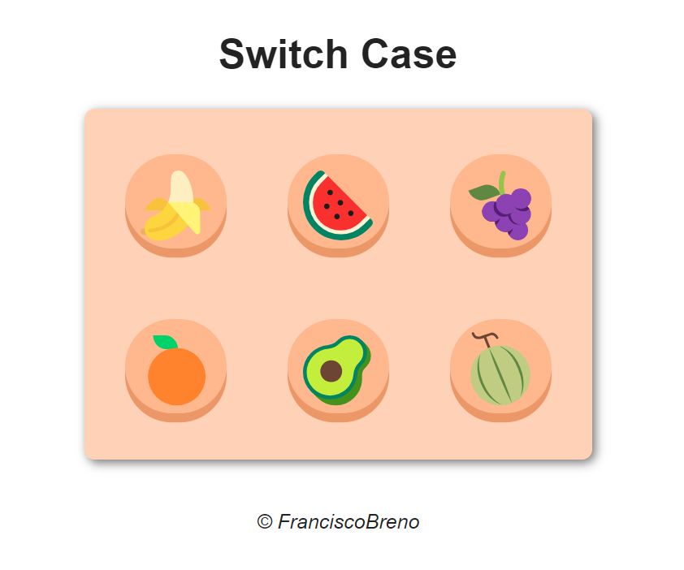

  <h1>Switch case em JavaScript</h1>

## Introdução

Este é um projeto simples desenvolvido para estudos de switch case em JavaScript. Ao clicar em um botão, o quadrado muda de cor, demonstrando a funcionalidade do comando switch case.

## Visualizar

Para ver o projeto em ação, clique [aqui](https://brenolira01.github.io/SwitchCase-JavaScript/)

## Demonstração do Projeto

## 🧠 Tecnologias Utilizadas

  

## Autor

Feito por [Francisco Breno](https://www.linkedin.com/in/breno-lira-perfil).

## 📫 Contato

