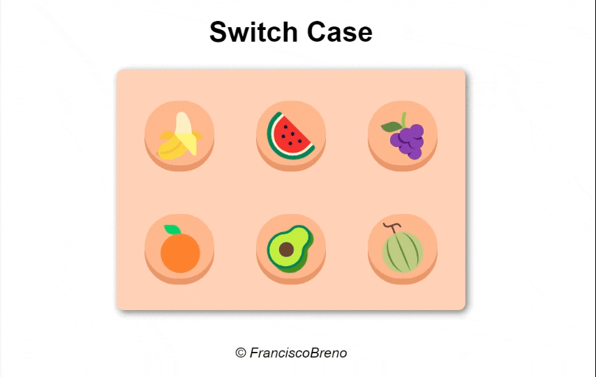

  <h1>Switch case em JavaScript</h1>

## Introdução

Este é um projeto simples desenvolvido para estudos de switch case em JavaScript. Ao clicar em um botão, o quadrado muda de cor, demonstrando a funcionalidade do comando switch case.

Clique [aqui](https://brenolira01.github.io/SwitchCase-JavaScript/) para ver o projeto.

## Demonstração do Projeto

## Tecnologias Utilizadas

  

## Contribuições

Contribuições são bem-vindas! Sinta-se à vontade para abrir problemas e solicitações de pull para melhorar este projeto.

## Autor

Feito por [Francisco Breno](https://www.linkedin.com/in/breno-lira-perfil).

## Contato

[Email](mailto:franciscobrenolira@gmail.com)

## Licença

Este projeto é licenciado sob os termos da [Licença MIT](/LICENSE.txt).
Leia o arquivo [LICENSE](/LICENSE.txt) para obter mais detalhes sobre as permissões e restrições da Licença MIT.
